# Architecture & Domain Taxonomy

This document describes the taxonomy the **Senior & Tech Lead Mobile Developer Guide** is
actually organised around, and the site architecture that renders it. It replaces an earlier
version of this file that documented a six-category taxonomy (Android / iOS / React Native /
Flutter / Mobile System Design / Tech Lead & Ops) the repository never had — see
`plan/gap-analysis.md` finding 06.

The full authoring reference lives in `plan/framework.md` and `plan/domains.md`. This file is
the summary a new contributor or a returning agent needs before touching code or content.

---

## The taxonomy: domain x band x platform

Content is not organised by technology stack. It is organised by **what a reader is trying to
become**, described along three axes:

1. **Domain** — one of 20 competency areas grouped into four tracks (see table below).
2. **Band** — `Mid` | `Senior` | `Lead`. Defined by scope of ownership and blast radius, not by
   years of experience or by how hard the technology is. `Staff` is retired from the ladder —
   it was never a rung above Tech Lead, it is the IC branch running parallel to it. See
   `plan/framework.md` → "Levels".
3. **Platform** — `android` | `ios` | `shared`. Some domains fully split by platform, some split
   only at Mid/Senior, some are platform-agnostic. See the "Platform treatment" column below and
   the parity-table convention it implies.

The unit of delivery is the **band unit** — one domain, one band, one platform variant,
shipped as a single article. See `plan/domains.md` for the full per-domain breakdown of every
band unit's sections and assessable outcome.

```mermaid
graph TD
    Root["Mobile Tech Lead Guide"]
    Root --> A["Track A — Core craft"]
    Root --> B["Track B — Production engineering"]
    Root --> C["Track C — Systems & judgement"]
    Root --> D["Track D — Leadership, product & delivery"]

    A --> A1["01 Programming fundamentals"]
    A --> A2["02 Platform & OS internals"]
    A --> A3["03 UI & interaction engineering"]
    A --> A4["04 Concurrency & asynchrony"]
    A --> A5["05 Data, persistence & offline"]
    A --> A6["06 Networking & API integration"]
    A --> A7["07 Architecture & modularisation"]

    B --> B1["08 Testing & quality"]
    B --> B2["09 Performance & efficiency"]
    B --> B3["10 Security & privacy"]
    B --> B4["11 Build, release & CI/CD"]
    B --> B5["12 Observability & reliability"]

    C --> C1["13 Mobile system design"]
    C --> C2["14 Technical decision making"]
    C --> C3["15 Technical debt & modernisation"]
    C --> C4["21 AI & LLM engineering"]

    D --> D1["16 Communication & technical writing"]
    D --> D2["17 Code review & mentoring"]
    D --> D3["18 Product & business acumen"]
    D --> D4["19 Planning, estimation & risk"]
    D --> D5["20 Technical leadership & influence"]
```



### Domain summary

| # | Domain | Track | Platform treatment |
| ---: | :--- | :--- | :--- |
| 01 | Programming fundamentals | A · Core craft | fully split |
| 02 | Platform & OS internals | A | fully split |
| 03 | UI & interaction engineering | A | fully split |
| 04 | Concurrency & asynchrony | A | fully split |
| 05 | Data, persistence & offline | A | split M+S, shared L |
| 06 | Networking & API integration | A | shared + parity |
| 07 | Architecture & modularisation | A | shared + parity |
| 08 | Testing & quality engineering | B · Production | shared + parity |
| 09 | Performance & efficiency | B | split M+S, shared L |
| 10 | Security & privacy | B | shared + parity |
| 11 | Build, release & CI/CD | B | split M+S, shared L |
| 12 | Observability & reliability | B | shared + parity |
| 13 | Mobile system design | C · Systems | shared + per-problem notes |
| 14 | Technical decision making | C | agnostic |
| 15 | Technical debt & modernisation | C | agnostic |
| 16 | Communication & technical writing | D · Leadership | agnostic |
| 17 | Code review & mentoring | D | agnostic |
| 18 | Product & business acumen | D | agnostic |
| 19 | Planning, estimation & risk | D | agnostic |
| 20 | Technical leadership & influence | D | agnostic |
| 21 | AI & LLM engineering | C · Systems | shared + per-problem notes |

"Fully split" means Mid, Senior and Lead each exist as separate Android and iOS articles.
"Split M+S, shared L" means Mid and Senior split by platform but the Lead band is one
platform-agnostic article. "Shared + parity" means one platform-agnostic article per band plus
a parity table naming where the platforms actually diverge. "Agnostic" (Track C/D) means the
capability itself does not depend on platform.

**Domain 01 is a documented, deliberate exception to the band-per-file shape** ("principle-based,
cross-language" in the table above). Rather than splitting each band across Android/iOS files, it
ships one article per programming-fundamentals principle (null safety, value vs reference
semantics, generics, error handling, and so on), each covering Kotlin, Java, Swift, Dart and
TypeScript side by side, with its own internal Mid/Senior/Lead sections. This does not change the
`Platform` type (still `android | ios | shared`, unchanged everywhere else in the site) — it adds
one additive `layout: 'principle-list'` field on domain 01's `DomainDef`
(`src/data/framework.ts`) that switches its `DomainView` page to a flat article list instead of
the grid, and a fourth `Band` value, `'X'`, meaning "not banded at the file level." No other
domain uses this shape. A companion page, `docs/00-tech-lead-roadmap/roadmap.md` (no `domain` —
it sits outside the taxonomy entirely), covers the system-level breadth a Tech Lead needs beyond
any one domain's depth. See `CONTRIBUTING.md` and `plan/domains.md` for the full rationale.

---

## Where the 20 domains live today (Phase 1)

Phase 1 ships a stub page per domain (`/domains/<domain-slug>` in the site's internal routing —
see below) showing its three band definitions, its platform treatment, an empty parity-table
placeholder where one is due, and links to whichever of the 14 pre-existing articles already
cover a slice of it. The actual re-filing/rewriting of those articles onto the new schema is
Phase 2 onward — `plan/gap-analysis.md` is the disposition table that maps every existing
article to the domain(s) it moves into.

---

## Content directory structure

Content is authored in Markdown with YAML frontmatter under `docs/`. Every article now lives
under a numbered domain directory; the original technology folders (`01-android`,
`02-architecture-and-principles`, `03-ai-and-ux-leadership`) and the legacy-category navigation
that surfaced them have been removed. Articles land at:

```
docs/<domain-slug>/<band-unit-slug>.md          e.g. docs/04-concurrency-and-asynchrony/mid-android.md
docs/<domain-slug>/assets/<slug>/               figures & captures for that article (see
                                                 .agents/rules/demonstration_assets.md)
```

Every article file's frontmatter carries, at minimum, `id`, `title`, `description`, `tags`,
`lang`, `status`. Once an article has been filed against the new taxonomy it additionally
carries `domain`, `band`, `platform`, `prerequisites`, `outcomes`, and (for platform-specific
units) `counterpart`. See `CONTRIBUTING.md` for the full article contract and
`scripts/check-contract.mjs` for the automated check.

**Frontmatter is the only source of truth.** `src/data/loadDocs.ts` reads `docs/**/*.md` at
build time via `import.meta.glob`, parses frontmatter with a small dependency-free parser, and
generates the registry the site renders from. There is no second, inline copy of article prose
in the site source — Phase 0 removed the ~600 lines of `content`/`contentEn` template literals
that used to duplicate these files inside `src/data/docsRegistry.ts`.

---

## Site architecture

- **Stack**: React 19 + Vite 6 + TypeScript (strict) + Tailwind 3. No server-side rendering, no
  external routing library — the app is a single page that switches between view variants held
  in React state (`src/App.tsx`), the same lightweight pattern it already used for `home` /
  `doc` before Phase 1 added more variants (`framework`, `matrix`, level landings, domain stubs,
  about).
- **i18n**: `src/context/I18nContext.tsx` holds the active language (`vi` | `en`), persisted to
  `localStorage`, exposing a `t()` translator for UI chrome strings. Article prose is not run
  through `t()` — each article's `content` (vi) and `contentEn` (en) slots are independent, and
  each carries its own `pending` / `complete` status (`langStatus` on `DocItem`). A missing or
  status-`pending` slot renders an explicit "not translated yet" banner instead of silently
  falling back to the other language (`src/components/DocViewer.tsx`).
- **Platform switch**: mirrors the language-toggle persistence pattern — a `PlatformContext`
  holding `android | ios | shared`, persisted to `localStorage`, used by domain/matrix views to
  pick which platform's band unit to show by default.
- **Search**: client-side substring search over the generated registry (`SearchModal.tsx`); no
  build-time search index.

## What changed here vs. the taxonomy this file used to describe

| Old (fictional) | Now |
| :--- | :--- |
| 6 top-level tech-stack categories (Android/iOS/RN/Flutter/SysDesign/LeadOps) | 20 domains across 4 tracks, independent of navigation category |
| `Level = Senior \| Lead \| Staff` | `Level = Mid \| Senior \| Lead`, `Staff` retired |
| Category is the primary axis of organisation | Domain x band x platform is; category is a legacy secondary browse view over the 14 pre-existing articles only |
| No prerequisite structure | `prerequisites: string[]` on `DocItem`, enforced by the contract checker |
| Single inline content string per doc | `content` / `contentEn`, each independently `complete`/`pending` |
