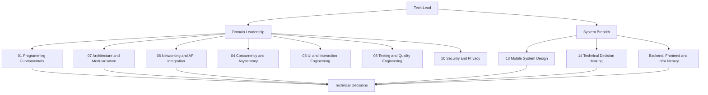

# Tech Lead Roadmap — System Breadth Beyond One Topic

Every article in Programming Fundamentals answers "what does Tech Lead-level mastery of *this one
topic* look like?" — that's depth, and it lives in each article's `## Lead` section. This page is
the other half: the **breadth** a Tech Lead needs across topics, so a technical decision in one
area (say, a caching strategy) is made with an accurate picture of what it costs somewhere else
(a backend team's on-call load, a Product roadmap, a migration already in flight).

**Honest scope note, up front:** this is a *mobile* Tech Lead guide. Some branches below — full
backend, frontend, or infrastructure engineering — are not things this guide teaches in depth, and
it would be dishonest to pretend otherwise. What a mobile Tech Lead actually needs from those
branches is *working literacy*: enough to ask the right question, read the right graph, and know
when to defer to the team that owns it. Where this guide does go deep on a branch, that's named
explicitly below.

## The breadth tree

```mermaid
graph TD
  TL["Tech Lead Breadth"]

  TL --> ST["System Thinking"]
  ST --> ST1["Backend"]
  ST --> ST2["Frontend"]
  ST --> ST3["Mobile"]
  ST --> ST4["Database"]
  ST --> ST5["Infrastructure"]

  TL --> SD["System Design"]
  SD --> SD1["Scalability"]
  SD --> SD2["Reliability"]
  SD --> SD3["Availability"]
  SD --> SD4["Caching"]
  SD --> SD5["Data flow"]

  TL --> TE["Technology Evaluation"]
  TE --> TE1["Build vs Buy"]
  TE --> TE2["Native vs Cross-platform"]
  TE --> TE3["Cost"]
  TE --> TE4["Performance"]
  TE --> TE5["Maintainability"]

  TL --> ES["Engineering Strategy"]
  ES --> ES1["Technical debt"]
  ES --> ES2["Migration"]
  ES --> ES3["Long-term architecture"]
  ES --> ES4["Evolution"]

  TL --> CC["Cross-team Collaboration"]
  CC --> CC1["API contracts"]
  CC --> CC2["Ownership"]
  CC --> CC3["Dependencies"]
  CC --> CC4["Technical decisions"]

  TL --> TLd["Technical Leadership"]
  TLd --> TLd1["Standards"]
  TLd --> TLd2["RFC or ADR"]
  TLd --> TLd3["Code review strategy"]
  TLd --> TLd4["Mentoring"]
  TLd --> TLd5["Decision making"]
```

### System Thinking

Awareness, not depth, for four of the five branches. **Mobile** is this guide's actual depth —
every domain here. **Backend, Database and Infrastructure**: what a mobile Tech Lead needs is
literacy in the *shape* of the system a mobile app talks to (what's cached where, what's eventually
consistent, what a deploy actually does to in-flight mobile sessions) — not the ability to operate
any of it. **Frontend** (web) matters mainly where its API contract is shared with mobile; the
Networking & API Integration domain in this guide covers that shared surface.

### System Design

This guide's own domain 13, Mobile System Design, teaches this branch in depth — the method
(requirements, NFRs, high-level design, data model, protocol, failure modes, trade-offs) and four
worked problems (offline-first sync, media pipelines, real-time updates, auth across restarts).
Caching and data flow specifically also recur in domain 05, Data, Persistence & Offline.

### Technology Evaluation

Domain 14, Technical Decision Making & Trade-offs, is this branch's home — writing an ADR that's
still useful a year later, deciding under incomplete data, and the native-vs-cross-platform
decision worked properly rather than as a table. Cost, performance and maintainability are the
named axes every ADR in that domain is expected to weigh explicitly.

### Engineering Strategy

Split across two domains: domain 07 (Architecture & Modularisation) owns long-term architecture and
its evolution; domain 15 (Technical Debt & Modernisation) owns technical debt as a funded,
quantified portfolio and migration as a sequenced, flag-gated process rather than a big-bang
rewrite.

### Cross-team Collaboration

API contracts are domain 06's subject end to end — including the exact mechanism (a shared schema,
a contract test, a lint rule) that keeps a nullable field honest across a backend/mobile boundary,
covered at the Lead level in this domain's own Type System & Null Safety article. Ownership,
dependencies and cross-team technical decisions are domain 18 (Product & Business Acumen) and
domain 20 (Technical Leadership & Influence).

### Technical Leadership

Domains 16 through 20 (Communication, Code Review & Mentoring, Product & Business Acumen,
Planning & Risk, Technical Leadership & Influence) are this branch's home in full — standards,
RFCs and ADRs, code review culture, mentoring, and making a call when consensus fails.

## How it all converges

A Tech Lead's actual job is not "know all of the above equally" — it's using domain depth and
system breadth together to make one thing: a technical decision that holds up.

A Mid-level engineer applies domain depth inside the boundary they were handed. A Senior extends
that depth to a whole subsystem. A Tech Lead is the one who has to hold both sides of this diagram
at once — deep enough in the domains to know what's actually true, broad enough across the system
to know what a decision costs somewhere they don't work day to day — and turn that into a decision
the team can execute, not just an opinion.

## Pitfalls & trade-offs

- **Mistaking breadth for depth.** Being conversant in "caching strategies" is not the same as
  having designed one under domain 13's method — a Tech Lead who can't tell the difference makes
  calls a Senior on the team could have made better.
- **Mistaking depth for breadth.** The opposite failure: a Tech Lead who stays in the one domain
  they're strongest in and never develops literacy in the branches they're weaker at, so every
  decision quietly optimizes for the thing they understand best.
- **Treating "Backend/Frontend/Infrastructure" as depth this guide should teach.** It shouldn't —
  a mobile guide that fakes depth in three adjacent disciplines teaches all of them badly. The
  honest version is literacy plus knowing exactly who to ask.
