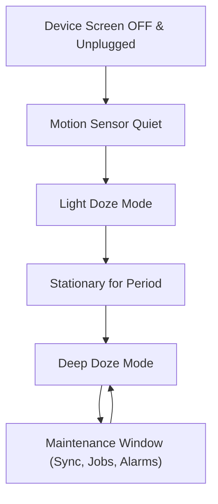

# Android Core Components & OS Execution Constraints

## ⚙️ 1. Service — Process Priority Signal to the LMK

> [!NOTE]
> A `Service` is **not a background thread** by default; it runs on the Main Looper Thread unless explicitly offloaded. Its primary OS function is serving as a **Process Priority Signal** to Android's Low Memory Killer (LMK).

### Service Execution Models
- **Foreground Service**: Holds active notification. Grants high process priority (`fg-service` bucket), protecting the process from LMK termination during memory pressure.
- **Bound Service**: Establishes IPC or local client-server binding. Priority elevates dynamically based on connected clients.
- **Background Service**: Strictly limited starting in Android 8.0 (API 26+). Deferred background execution **must** migrate to `WorkManager`.

---

## 📡 2. Broadcast Receiver & PendingIntent Wrappers

### Broadcast Receiver
- Serves as a transient entry point for system signals (boot completed, connectivity changed, battery low).
- `onReceive()` must complete within **10 seconds** on the Main Thread to avoid ANRs.

### PendingIntent Security & Mechanics
`PendingIntent` is a token wrapper delegating execution authorization to another process (e.g., System Notification Manager, AlarmManager).

```kotlin
val intent = Intent(context, TargetActivity::class.java)
val pendingIntent = PendingIntent.getActivity(
    context,
    0,
    intent,
    PendingIntent.FLAG_UPDATE_CURRENT or PendingIntent.FLAG_IMMUTABLE
)
```

> [!IMPORTANT]
> Always specify `FLAG_IMMUTABLE` (or `FLAG_MUTABLE` only when explicit intent modification by recipient is required) to prevent **PendingIntent Hijacking** vulnerabilities on Android 12+.

---

## 🔋 3. Doze Mode, Standby Buckets & Background Restrictions



- **Doze Mode**: Restricts network access, defers `JobScheduler` tasks, and suspends high-frequency syncs when the device is idle and stationary.
- **Standby Buckets**: Apps categorized into `Active`, `Working Set`, `Frequent`, `Rare`, and `Restricted` buckets based on user engagement frequency.
- **WorkManager**: Unified solution wrapping `JobScheduler`, `AlarmManager`, and `ForegroundService` ensuring guaranteed background execution across device vendors.
