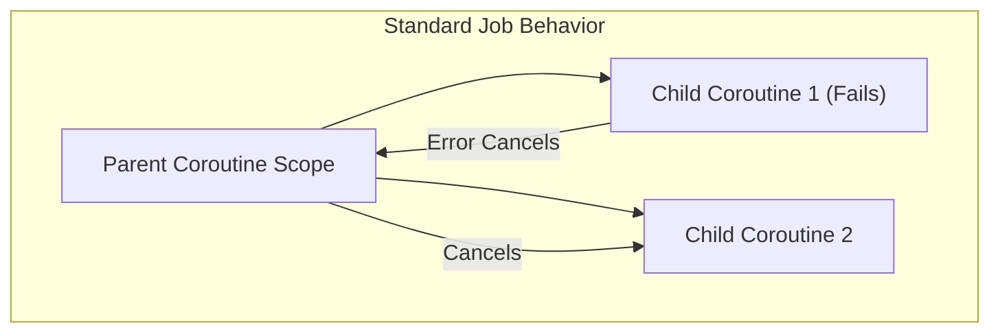

# Kotlin Coroutines, Flow & Concurrency Mechanics

## ⚡ 1. Job vs SupervisorJob & Failure Propagation



- **Job**: Exception in any child coroutine cancels the parent coroutine, which in turn cancels all sibling coroutines.
- **SupervisorJob**: Exception in a child coroutine is isolated; sibling coroutines continue running undisturbed.

```kotlin
// Correct SupervisorJob usage for independent parallel tasks
val scope = CoroutineScope(Dispatchers.Default + SupervisorJob())
scope.launch { fetchUserData() }
scope.launch { fetchAnalytics() } // Continues even if fetchUserData fails
```

---

## 🔬 2. Continuation & Callback Frame Mechanics

Under the hood, Kotlin suspend functions are transformed by the compiler into State Machines passing a `Continuation<T>` instance (**CPS - Continuation Passing Style**).

```kotlin
// Kotlin Code
suspend fun getUserData(): UserData = withContext(Dispatchers.IO) { ... }

// Decompiled Bytecode Conceptual Signature
Object getUserData(Continuation<? super UserData> $completion)
```

---

## 🌊 3. StateFlow vs SharedFlow Reactive Streams

| Operator / Stream | Replay Cache | Hot/Cold | Best Use Case |
| :--- | :--- | :--- | :--- |
| **StateFlow** | Always retains 1 latest state value | Hot | UI State representation (`StateFlow<UiState>`) |
| **SharedFlow** | Configurable replay (default 0) | Hot | One-off UI Events (`SharedFlow<UiEvent>`, navigation, toasts) |
| **Flow** | No replay | Cold | Database / Network streams created per collector |
