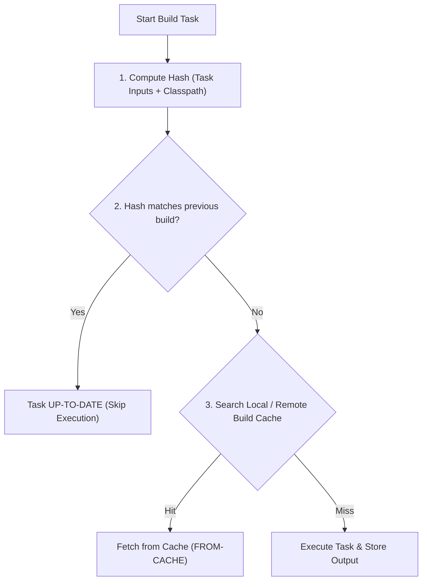

# Gradle Build Optimization & Profiling Tools

## 🚀 1. Essential Gradle Profiling Toolkit

1. **Gradle Build Scan (`--scan`)**: Analyzes build phase allocation (Configuration vs Execution), dependency resolution bottlenecks, and cache hits/misses.
2. **Dependency Analysis Gradle Plugin**: Detects unused dependencies, transitive dependency leaks, and incorrect `api` vs `implementation` usages.
3. **Gradle Profiler**: Command-line tool running benchmark scenarios (ABI changes, non-ABI changes, clean builds) to measure precise build time regressions.
4. **Module Graph Assert**: Enforces architectural dependency rules via CI assertions (e.g. preventing feature modules from depending on other feature modules).

```kotlin
// moduleGraphAssert configuration in root build.gradle.kts
moduleGraphAssert {
    maxHeight = 4
    allowed = listOf(
        ":feature:.* -> :core:.*",
        ":app -> :feature:.*"
    )
    restricted = listOf(
        ":feature:.* -X-> :feature:.*" // Chokes cross-feature coupling
    )
}
```

---

## 🧮 2. Gradle Input Hash Key & Cache Decisions



> [!TIP]
> Ensure build tasks specify explicit `@Input` and `@OutputDirectory` annotations to avoid cache invalidations caused by non-deterministic absolute paths or system timestamps.
