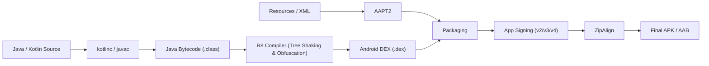

# Android APK Compilation Pipeline & R8/ProGuard Optimizations

## 🏗️ 1. Complete Android Build Pipeline



---

## ✂️ 2. R8 Compilation Engine Phases

1. **Tree Shaking (Shrinking)**: Traces reachable code starting from entry points (`AndroidManifest.xml`, kept classes) and eliminates unused classes, methods, and fields.
2. **Optimization**: Rewrites bytecode to optimize performance (inlining short functions, removing unused parameters, enum unboxing).
3. **Obfuscation**: Renames remaining classes and members with short non-meaningful names (e.g. `a.b.c`) to hinder reverse engineering.
4. **Desugaring**: Converts modern Java 8+ / Kotlin features into bytecode compatible with older Android OS versions.

---

## 🛠️ 3. Essential ProGuard / R8 Rules

```proguard
# Preserve line numbers and source file attributes for Crashlytics stack traces
-renamesourcefileattribute SourceFile
-keepattributes SourceFile,LineNumberTable

# Prevent obfuscation of serializable data classes used in JSON parsing
-keepclassmembers class * implements java.io.Serializable {
    static final long serialVersionUID;
    private static final java.io.ObjectStreamField[] serialPersistentFields;
    !static !transient <fields>;
}

# Keep annotated entry points for reflection-based SDKs
-keepclassmembers class * {
    @com.google.gson.annotations.SerializedName <fields>;
}
```
