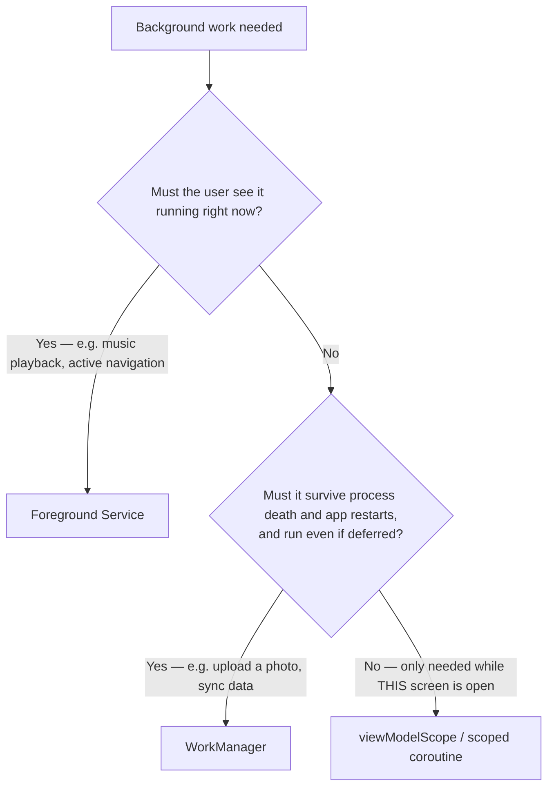

# Background Work & Scheduling, Across Android, iOS & Flutter

Asking for background work is really asking one of three different favors, and mixing them up is
where most of the bugs in this article start. "Do this right now while I watch" is a foreground
service. "Do this whenever you get a chance — no promises, might not happen at all" is
`BGTaskScheduler`. "Get to it eventually, guaranteed, just not necessarily on my schedule" is
`WorkManager`. Three different favors, three different reliability contracts — and a mobile
engineer who treats them as interchangeable finds out the difference in production, not in a code
review.

## Mid

**Interview question: "How do you pick the right background-work mechanism for a given
constraint?"**

Start with the constraint, not the API you already know.

**Android has a genuine decision tree**, and the three branches trade off differently:



Each platform's mechanism below fits one row of that tree — worth reading as one consecutive set
before the explanation of each.

**Android.** `viewModelScope` for screen-scoped work, `WorkManager` for deferrable guaranteed
work.

```kotlin
// Only needed while this screen is open — no persistence, stops silently when
// the ViewModel clears. Fine for a search-as-you-type request; wrong for anything
// that must survive the user navigating away.
viewModelScope.launch { repository.search(query) }

// Must survive process death and app restarts, and is fine running later.
// Constraints are declared, not polled for — WorkManager guarantees eventual
// execution once they're met.
val request = OneTimeWorkRequestBuilder<UploadPhotoWorker>()
    .setConstraints(Constraints.Builder().setRequiredNetworkType(NetworkType.CONNECTED).build())
    .build()
WorkManager.getInstance(context).enqueue(request)
```

**iOS.** `BGTaskScheduler` registers a background task the system runs entirely at its own
discretion.

```swift
func scheduleAppRefresh() {
    let request = BGAppRefreshTaskRequest(identifier: "com.example.app.refresh")
    request.earliestBeginDate = Date(timeIntervalSinceNow: 15 * 60)
    try? BGTaskScheduler.shared.submit(request)
}

func handleAppRefresh(task: BGAppRefreshTask) {
    // Reschedule for next time BEFORE this task's own work even starts —
    // there's no guarantee this invocation gets to finish.
    scheduleAppRefresh()
    let operation = RefreshOperation()
    task.expirationHandler = { operation.cancel() }
    operation.completionBlock = { task.setTaskCompleted(success: !operation.isCancelled) }
    operation.start()
}
```

**Flutter.** The `workmanager` package wraps both of the above behind one Dart API.

```dart
// One call, same shape on both platforms — but NOT one guarantee underneath.
Workmanager().registerPeriodicTask(
  "upload-task",
  "uploadPhotoTask",
  frequency: const Duration(hours: 1),
);
```

Not "later, guaranteed," but "maybe, if conditions look favorable" — that's the honest reading of
`BGTaskScheduler`. The simulator can force a background task to run on demand, a debugger command
that exists specifically because otherwise nobody could test this path at all. A real device
instead weighs battery level, how recently and how often the user opens the app, and system-wide
load, and can go days without running the task even once. **There is no Android equivalent to this
uncertainty:** `WorkManager` guarantees eventual execution once its constraints are met;
`BGTaskScheduler` guarantees only that an attempt *might* be made.

`workmanager`'s uniform API surface is exactly the trap: it's a thin wrapper, not a third,
unified guarantee. On Android it inherits `WorkManager`'s real guarantee — the task runs
eventually once constraints are met. On iOS it inherits `BGTaskScheduler`'s best-effort
uncertainty — the OS may simply never run it. A Flutter engineer who reads only the `workmanager`
package docs, without already knowing the Android/iOS difference underneath, can miss this
asymmetry entirely — the package's uniformity makes the wrong assumption *easier* to make, not
harder.

**Follow-up an interviewer asks next:** "What happens if you get the choice wrong?" Choosing
scoped work (`viewModelScope` or its equivalent) for something that must outlive the screen fails
silently — the work just stops when the scope clears, no error, no crash. Choosing a foreground
service for work nobody needed to see costs a persistent notification for no reason. On Flutter,
assuming `workmanager`'s guarantee is uniform because the Dart API looks identical across
platforms means an iOS build can silently skip work a QA pass on Android never caught.

> [!WARNING]
> **Mid pitfall.** Picking a screen-scoped coroutine for work that must survive the screen closing
> is the single most common mistake here — and the opposite mistake, a foreground service for
> invisible work, trades a real UX cost (a persistent notification) for reliability `WorkManager`
> would have given for free. On Flutter, the parallel mistake is trusting `workmanager`'s uniform
> API as a uniform guarantee — always test the iOS best-effort path on a real device, not just the
> Android side where it "worked."

## Senior

**Interview question: "Your background work needs to hand data across a process or extension
boundary — what actually breaks at scale?"**

Every one of these platforms has a call that *looks* local but isn't, and every one of them
punishes a large payload sent across it the same way: a size or memory limit that has nothing to
do with how big the payload would be allowed to be in-process.

**Android.** Almost everything that looks like a local call — starting an `Activity`, binding a
`Service`, querying a `ContentProvider` — actually crosses a process boundary via Binder, the
kernel driver mediating Android IPC.

```kotlin
// AIDL-defined interface — reads like a normal method call and isn't one.
interface IRemoteDataService {
    fun fetchLargeDataset(): List<DataItem> // looks like a normal call; is not
}
```

**iOS.** An app extension — a share extension, a widget, a notification service extension — runs
as its own process with its own, often much smaller, Jetsam memory limit.

```swift
// A notification service extension has roughly 24MB before Jetsam kills it
// (device-dependent) — decoding a large image to build a rich notification
// can exceed this budget on its own.
class NotificationService: UNNotificationServiceExtension {
    override func didReceive(_ request: UNNotificationRequest,
                              withContentHandler contentHandler: @escaping (UNNotificationContent) -> Void) {
        // Downscale BEFORE decoding fully into memory — the extension's budget assumes it.
    }
}
```

**Flutter.** `MethodChannel` is Flutter's own IPC layer, structurally the same shape as
Binder/AIDL.

```dart
// Looks like a normal async call; actually serializes args across the Dart<->native boundary.
final result = await platform.invokeMethod('fetchLargeDataset');
```

Binder has a transaction size limit (historically around 1MB, shared across all in-flight
transactions for the whole process) — a large `Bundle` or list pushed through an `Intent` or an
AIDL call can throw `TransactionTooLargeException`. This matters directly for background work: a
bound service reporting progress or results back across the process boundary is exactly the kind
of call that quietly grows past this limit as a feature evolves. The fix is structural, not a
bigger limit: cross the boundary with a reference — a file descriptor, a small id to re-fetch the
real payload by — never the payload itself.

An iOS extension's budget is separate and often far smaller: a widget's limit is typically tens
of megabytes, an order of magnitude below the host app's. Code shared between an app and its
extension via XPC or an app group container has to be written against the extension's budget, not
the host app's — the same function that runs fine as part of background work in the main app can
crash the moment it's reused inside a notification service extension handed the same payload.

Flutter's own guidance is the identical fix in the identical shape as Binder's: a large payload
over a `MethodChannel` has a real, documented performance cost, so pass a reference or identifier
for large data, not the payload itself — the same discipline the Bundle-size limit forces on
Android, applied at the Dart/native seam instead of the process seam.

**Follow-up:** "So how do you actually verify this before it ships?" Load-test the boundary with
a payload representative of the worst real case, not the demo case — a dataset that grows with
user data (a large photo, a long list, a big JSON blob) is exactly the kind of thing that passes
review small and fails in the field once it grows.

> [!WARNING]
> **Senior pitfall.** Assuming a boundary that worked fine in development scales the same way in
> production — a `Bundle`, an AIDL call, an XPC payload, or a `MethodChannel` argument that was
> small during testing and grows because the underlying data (a photo, a synced list) grows with
> real usage. The fix is the same shape everywhere in this article: send a reference, not the
> payload, and re-fetch on the other side.

## Cross-platform comparison table

| | Android | iOS | Flutter |
|---|---|---|---|
| Guaranteed background execution | `WorkManager` — yes, once constraints are met | `BGTaskScheduler` — best-effort only, may never run | `workmanager` package — inherits whichever platform's guarantee sits underneath |
| User-visible ongoing work | Foreground service, backed by a persistent notification | No direct equivalent — App Store review discourages faking an ongoing foreground presence | Must be built via a platform channel down to native foreground-service-equivalent code |
| Cross-process or extension IPC | Binder, roughly a 1MB transaction limit per process | XPC, extension-specific Jetsam budget (often tens of MB) | `MethodChannel`, same reference-not-payload discipline applies |

## Pitfalls & trade-offs

- **Mid:** picking screen-scoped work (`viewModelScope` or equivalent) for something that must
  outlive the screen — it stops silently, with no error, the moment the scope clears.
- **Mid:** picking a foreground service for work the user never needed to see — trading a real,
  visible notification for reliability that `WorkManager` would have given without the UX cost.
- **Mid:** assuming `workmanager`'s uniform Dart API means a uniform guarantee — it does not;
  test the iOS best-effort path on a real device before trusting it in production.
- **Senior:** sending a large payload directly across a Binder call, an XPC extension boundary, or
  a `MethodChannel` — each platform enforces its own hard limit, and each is fixed the same way:
  a reference across the boundary, the real payload fetched on the other side.
- **Senior:** reusing app-scoped code inside an iOS extension without checking its memory budget —
  a function that behaves fine in the host app can single-handedly exceed a notification service
  extension's entire Jetsam limit.
