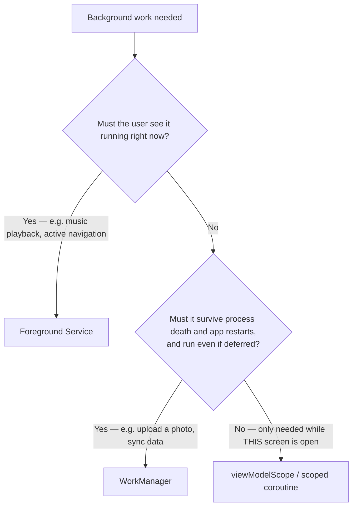

# Background Work & Scheduling on Android — WorkManager's Real Guarantee & the Binder Size Limit

Asking for background work is really asking one of three different favors, and mixing them up is
where most of the bugs in this article start. "Do this right now while I watch" is a foreground
service. "Get to it eventually, guaranteed, just not necessarily on my schedule" is `WorkManager`.
"Only while this screen is open" is a scoped coroutine.

## Mid {concept=background-work/mechanism-choice}

**Interview question: "How do you pick the right background-work mechanism for a given
constraint?"**

Start with the constraint, not the API you already know. **Android has a genuine decision tree**:



```kotlin
// Only needed while this screen is open — no persistence, stops silently when
// the ViewModel clears. Fine for a search-as-you-type request; wrong for anything
// that must survive the user navigating away.
viewModelScope.launch { repository.search(query) }

// Must survive process death and app restarts, and is fine running later.
// Constraints are declared, not polled for — WorkManager guarantees eventual
// execution once they're met.
val request = OneTimeWorkRequestBuilder<UploadPhotoWorker>()
    .setConstraints(Constraints.Builder().setRequiredNetworkType(NetworkType.CONNECTED).build())
    .build()
WorkManager.getInstance(context).enqueue(request)
```

**There is no iOS equivalent to `WorkManager`'s guarantee:** `WorkManager` guarantees eventual
execution once its constraints are met — iOS's `BGTaskScheduler` only guarantees that an attempt
*might* be made, at the system's discretion.

**Follow-up an interviewer asks next:** "What happens if you get the choice wrong?" Choosing scoped
work (`viewModelScope`) for something that must outlive the screen fails silently — the work just
stops when the scope clears, no error, no crash. Choosing a foreground service for work nobody
needed to see costs a persistent notification for no reason.

**Pitfall at this level:** picking a screen-scoped coroutine for work that must survive the screen
closing — the single most common mistake here — and the opposite mistake, a foreground service for
invisible work, trades a real UX cost (a persistent notification) for reliability `WorkManager`
would have given for free.

## Senior {concept=background-work/ipc-boundary}

**Interview question: "Your background work needs to hand data across a process boundary — what
actually breaks at scale?"**

**Almost everything that looks like a local call — starting an `Activity`, binding a `Service`,
querying a `ContentProvider` — actually crosses a process boundary via Binder**, the kernel driver
mediating Android IPC.

```kotlin
// AIDL-defined interface — reads like a normal method call and isn't one.
interface IRemoteDataService {
    fun fetchLargeDataset(): List<DataItem> // looks like a normal call; is not
}
```

Binder has a transaction size limit (historically around 1MB, shared across all in-flight
transactions for the whole process) — a large `Bundle` or list pushed through an `Intent` or an
AIDL call can throw `TransactionTooLargeException`. This matters directly for background work: a
bound service reporting progress or results back across the process boundary is exactly the kind
of call that quietly grows past this limit as a feature evolves. **The fix is structural, not a
bigger limit: cross the boundary with a reference — a file descriptor, a small id to re-fetch the
real payload by — never the payload itself.**

**Follow-up:** "So how do you actually verify this before it ships?" Load-test the boundary with a
payload representative of the worst real case, not the demo case — a dataset that grows with user
data (a large photo, a long list, a big JSON blob) is exactly the kind of thing that passes review
small and fails in the field once it grows.

**Pitfall at this level:** assuming a Binder boundary that worked fine in development scales the
same way in production — a `Bundle` or AIDL call that was small during testing and grows because
the underlying data grows with real usage.

## Cross-platform comparison

See the cross-platform comparison table in the iOS or Flutter version of this topic (switch the
platform tab above) for how iOS's `BGTaskScheduler` best-effort guarantee and extension memory
budgets differ from WorkManager and Binder's transaction limit.

## Pitfalls & trade-offs

- **Mid:** picking screen-scoped work for something that must outlive the screen — it stops
  silently, with no error, the moment the scope clears.
- **Mid:** picking a foreground service for work the user never needed to see — trading a real,
  visible notification for reliability `WorkManager` would have given without the UX cost.
- **Senior:** sending a large payload directly across a Binder call — each grows past
  `TransactionTooLargeException` the same way; the fix is a reference across the boundary, the real
  payload fetched on the other side.
