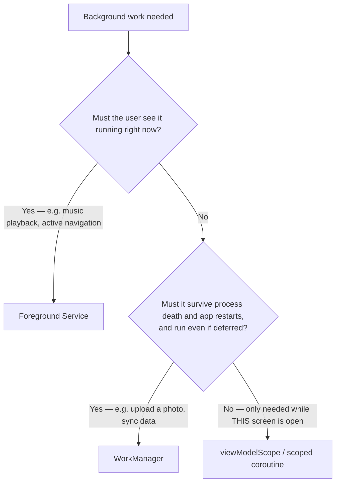

# Lifecycle, Background Work Choice & the Manifest as an API

> **Outcome.** Given a background task with stated constraints — must it run now, can it wait,
> does it need to survive process death — pick the right component and defend the choice
> against the two you rejected.

## 1. Lifecycle & configuration change

An `Activity` is destroyed and recreated on a configuration change (rotation, locale, theme) by
default — the instance you held a reference to is gone, and a new one takes its place.

```kotlin
class ProfileActivity : AppCompatActivity() {
    override fun onCreate(savedInstanceState: Bundle?) {
        super.onCreate(savedInstanceState)
        // savedInstanceState is non-null when the system recreated this Activity
        // after destroying the previous instance — this is not "first launch".
        val scrollPosition = savedInstanceState?.getInt("scroll_position") ?: 0
    }

    override fun onSaveInstanceState(outState: Bundle) {
        super.onSaveInstanceState(outState)
        outState.putInt("scroll_position", currentScrollPosition)
    }
}
```

`ViewModel` survives configuration change by design — it is retained across the
destroy/recreate cycle that kills the `Activity`, which is why UI state belongs in a
`ViewModel` and not in Activity fields.

## 2. Process death and state restoration — a different event from configuration change

The system can kill the whole process while it is backgrounded, to reclaim memory for something
the user is actively using. This is not a crash and not a configuration change — it is a
scenario every screen must survive, because from the user's perspective they just switched back
to an app that was "still there."

```kotlin
class ProfileActivity : AppCompatActivity() {
    // onSaveInstanceState also fires before process death (the system persists the Bundle
    // to disk), so the SAME mechanism handles both configuration change and process death —
    // the distinction that matters is what must be restored versus what can be re-fetched.
    override fun onSaveInstanceState(outState: Bundle) {
        super.onSaveInstanceState(outState)
        outState.putString("draft_text", currentDraftText) // unsaved user input — must survive
        // Do NOT stash a full fetched profile object here — it can be re-fetched;
        // the Bundle has a size limit (TransactionTooLargeException past ~1MB total).
    }
}
```

> [!IMPORTANT]
> The question to ask for every piece of screen state: "if the process died right now and the
> user came back in five minutes, what would they be upset to lose?" Unsaved input is worth the
> `Bundle` cost. Re-fetchable data is not — put it back through the normal load path instead.

## 3. Choosing a background mechanism — the actual decision tree

Three real options, and the constraint that decides between them:



| Mechanism | Survives process death | Survives app being swiped away | Fits |
| :--- | :--- | :--- | :--- |
| `viewModelScope` (scoped coroutine) | No | No | Work meaningful only while this screen exists — a search-as-you-type request |
| `WorkManager` | Yes | Yes | Deferrable, guaranteed-eventually work — a photo upload, a periodic sync |
| Foreground service | Only while the notification exists | No | User-visible ongoing work — music playback, an active navigation session |

> [!WARNING]
> Picking `viewModelScope` for something that must survive the screen closing is the most
> common Mid-level mistake here — the work simply stops when the `ViewModel` clears, silently,
> with no error. Picking a foreground service for something the user was never meant to see is
> the opposite mistake: it requires a persistent notification (a real UX cost) for work that
> `WorkManager` would have handled invisibly and more reliably.

## 4. Runtime permissions and denial flows

A permission request has three outcomes an app must handle, not two:

```kotlin
val requestPermissionLauncher = registerForActivityResult(
    ActivityResultContracts.RequestPermission()
) { isGranted ->
    if (isGranted) {
        startCamera()
    } else if (shouldShowRequestPermissionRationale(Manifest.permission.CAMERA)) {
        // Denied once, but the system will still show the prompt again —
        // this is the moment to explain WHY before asking again.
        showRationaleDialog()
    } else {
        // Denied and "don't ask again" was checked, OR this is the first request
        // (the two are indistinguishable from this callback alone) — the prompt
        // will not appear again; the only path forward is Settings.
        showGoToSettingsMessage()
    }
}
```

## 5. Intents, deep links, and the manifest as an API surface

Every `<intent-filter>` and exported component in `AndroidManifest.xml` is a public entry point
into the app — reachable by any other app or, for a deep link, any web page — whether or not it
was designed with that in mind.

```xml
<activity android:name=".DeepLinkActivity" android:exported="true">
    <intent-filter>
        <action android:name="android.intent.action.VIEW" />
        <category android:name="android.intent.category.DEFAULT" />
        <category android:name="android.intent.category.BROWSABLE" />
        <data android:scheme="https" android:host="example.com" android:pathPrefix="/profile" />
    </intent-filter>
</activity>
```

> [!IMPORTANT]
> Reading the manifest for risk means reading every `android:exported="true"` component as a
> public API endpoint: what data does its `Intent` extras trust without validating, and could a
> malicious app construct the same `Intent` and reach it directly, bypassing whatever screen
> normally leads there?

## Pitfalls & trade-offs

- **Confusing configuration change with process death.** They share the `onSaveInstanceState`
  mechanism but have different real-world triggers and different costs for getting the
  restoration wrong — test both explicitly (developer option "Don't keep activities" simulates
  process death on demand).
- **Choosing `viewModelScope` for work that must outlive the screen.** Covered above — this is
  the single most common wrong choice among the three background mechanisms.
- **Stashing large or re-fetchable data in `onSaveInstanceState`.** The Bundle has a real size
  limit; treat it as a small notepad for unsaved input, not a cache.
- **Treating "permission denied" as one case instead of three.** First-time denial, denial with
  rationale still available, and permanent denial each need a different UI response — collapsing
  them into one "you said no" dialog produces a dead end for the permanently-denied case, where
  Settings is the only remaining path.
- **An exported component that trusts its `Intent` extras.** Any `android:exported="true"`
  component is reachable by any other app on the device — validate its inputs exactly as you
  would a network request from an untrusted client.
