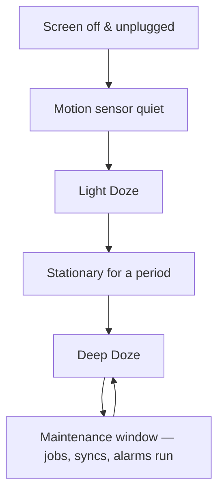

# Process Priority, Doze/Buckets, Binder & Start Sequencing

> **Outcome.** Diagnose why a process is being killed in the field — from a bug-report trace and
> the Vitals dashboard — without a local reproduction, because for this class of bug a
> reproduction is often not available at all.

## 1. `Service` as a priority signal to the LMK

A `Service` is not a background thread by default — it runs on the main looper unless explicitly
offloaded. Its real function is telling Android's Low Memory Killer how important this process
is to keep alive when the system needs to reclaim memory.

```kotlin
// Foreground service: holds an active notification, which elevates process priority
// into the fg-service bucket — one of the least likely to be killed under pressure.
class MusicPlaybackService : Service() {
    override fun onStartCommand(intent: Intent?, flags: Int, startId: Int): Int {
        startForeground(NOTIFICATION_ID, buildPlaybackNotification())
        return START_STICKY
    }
}
```

| Component | LMK priority signal | Killed under memory pressure |
| :--- | :--- | :--- |
| Foreground service | High (`fg-service` bucket) | Rarely, and the notification tells the user why |
| Bound service | Elevated while a client is bound, tied to the client's own priority | When the last client unbinds or is itself killed |
| Plain background service | Not allowed to start on API 26+ | N/A — migrate to `WorkManager` |

## 2. Doze mode, standby buckets, and restriction tiers



Independent of Doze, every app is placed into a **standby bucket** based on how recently and how
often the user engages with it — `Active`, `Working Set`, `Frequent`, `Rare`, `Restricted` — and
the bucket directly throttles how often `WorkManager`/`JobScheduler` jobs are allowed to run,
regardless of what the job itself requested.

> [!IMPORTANT]
> A process killed in the field is not necessarily a bug in the traditional sense — it may be
> the LMK doing exactly what it is designed to do to a process with low priority signals, in a
> restricted standby bucket, during Doze. Diagnosing "why was my process killed" means checking
> the component's priority signal and the app's standby bucket before looking for a leak.

## 3. Binder, IPC boundaries and their cost

Almost everything a Compose or View-based app does that looks like a local call — starting an
`Activity`, binding a `Service`, querying a `ContentProvider` — actually crosses a process
boundary via Binder, the kernel driver mediating inter-process communication on Android.

```kotlin
// AIDL-defined interface — Binder generates the marshalling/unmarshalling code that
// serializes this call across the process boundary and back.
interface IRemoteDataService {
    fun fetchLargeDataset(): List<DataItem> // looks like a normal call; is not
}
```

> [!WARNING]
> Binder has a transaction size limit (historically ~1MB, shared across all in-flight
> transactions for the process) — passing a large `Bundle` or a big list through an `Intent` or
> AIDL call can throw `TransactionTooLargeException`, and it does not scale the way an in-process
> call does. Cross a Binder boundary with a reference (a file descriptor, a small identifier to
> re-fetch by), not with the payload itself.

## 4. Cold, warm and hot start sequencing

```kotlin
// Cold start: process doesn't exist. Zygote forks a new process, Application.onCreate()
// runs, then the first Activity's onCreate/onStart/onResume. Slowest, most instrumented.
class MyApplication : Application() {
    override fun onCreate() {
        super.onCreate()
        // Every synchronous initializer here delays time-to-first-frame for EVERY cold start.
        AnalyticsSdk.init(this) // audit: does this really need to block onCreate?
    }
}
```

| Start type | Process state | What runs | Relative cost |
| :--- | :--- | :--- | :--- |
| Cold | Doesn't exist | Zygote fork → `Application.onCreate` → Activity lifecycle | Highest |
| Warm | Exists, Activity destroyed | Activity lifecycle only, `Application.onCreate` skipped | Medium |
| Hot | Exists, Activity in memory | `onResume` only | Lowest |

## 5. OEM divergence, and how to learn of it before users do

Vendor-customised Android (aggressive battery managers on top of AOSP's standard behaviour, on
several major manufacturers) can kill or restrict a process more aggressively than stock Doze
and standby buckets alone would predict — behaviour that is not documented by Google and varies
by vendor and OS version.

> [!NOTE]
> The practical mitigation is not fighting each vendor's battery manager individually — it is
> instrumenting the app to *know* when this is happening (a "we were killed while the user
> expected the foreground service to keep running" signal reaching your own telemetry) rather
> than discovering it only from a support ticket or a low Vitals score with no further detail.

## Diagnosing a field kill from a trace and Vitals, without a reproduction

The outcome this article checks for is a specific diagnostic sequence:

1. **Check the Vitals ANR/excessive-wakeup/stuck-background dashboards** for the affected
   device/OEM/OS-version segment — a kill concentrated on one manufacturer points at OEM
   divergence before anything else.
2. **Read the component's priority signal** — was the work running in a foreground service with
   an active notification, a bound service, or (the most common actual cause) a plain background
   attempt that should have migrated to `WorkManager` already.
3. **Check the standby bucket implied by the usage pattern** — a feature only used by
   infrequent-opener users is disproportionately likely to be throttled by their bucket, which
   segments the complaint by user behaviour, not by device.
4. **Only then** suspect a genuine leak or crash — which a heap dump or crash-free-sessions
   metric, not a kill-rate metric, would actually show.

## Pitfalls & trade-offs

- **Treating every field kill as a bug to reproduce locally.** Many are the LMK operating
  correctly against a low-priority signal — the fix is changing the component's priority
  strategy, not hunting for a repro that may not exist on a well-provisioned dev device.
- **Passing a large payload across a Binder boundary.** Covered above — pass a reference, fetch
  the payload on the other side.
- **Blocking initialization in `Application.onCreate`.** Every synchronous call there taxes
  every single cold start; defer what isn't needed for the first frame.
- **Assuming AOSP-documented battery behaviour is the whole story.** OEM battery managers are a
  real, undocumented variable — segment kill-rate data by manufacturer before concluding
  anything about a supposed leak.
