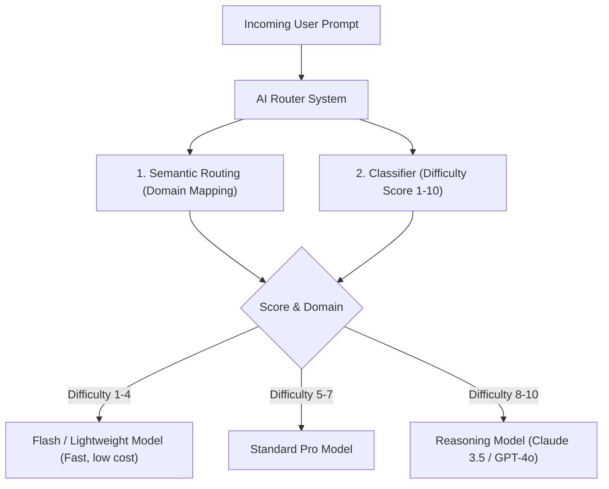

# Enterprise AI Model Routing & Classifier Architecture

## 🤖 1. Dynamic AI Model Dispatch Mechanism

---

## 🛠️ 2. Core Routing Mechanics

1. **Semantic Routing**: Matches prompt embedding vectors against domain clusters (e.g. Code refactoring, UI layout, SQL query) to identify target model specialization.
2. **Classifier Scoring**: Evaluates prompt token length, reasoning steps required, and dependency constraints to assign a numeric difficulty tier.
3. **Cost & Latency Optimization**: Directs low-complexity queries to smaller, faster models to minimize API latency and token expenditure.
