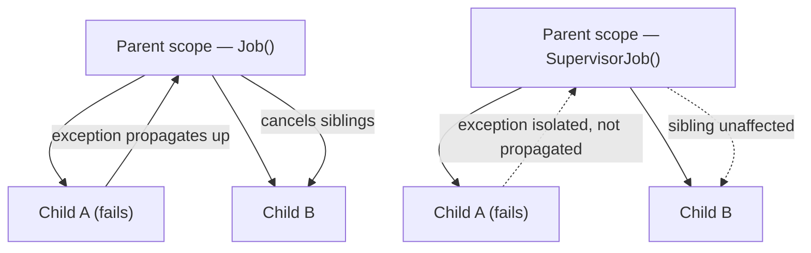

# Structured Concurrency, Continuations & Flow Backpressure

> **Outcome.** Design the concurrency model for a screen with three concurrent sources and one
> cancellable write, and state precisely what happens to each of the four when any one of them
> fails.

## 1. `Job` vs `SupervisorJob` — failure propagation is a property of the scope



With a plain `Job`, a child's uncaught exception cancels the parent, which cancels every other
child — "all or nothing" is the design, and it is usually the right one for work that is only
meaningful together (fetch three fields of one form; if one fails, the form is incomplete
regardless of the other two).

With a `SupervisorJob`, a child's failure is isolated to that child. This is the right model for
independent, unrelated work sharing one scope for convenience:

```kotlin
class DashboardViewModel : ViewModel() {
    // Three independent widgets. A failed analytics call should never take
    // down the user-profile widget — that is precisely what SupervisorJob buys.
    private val supervisorScope = CoroutineScope(SupervisorJob() + Dispatchers.Main.immediate)

    fun loadDashboard() {
        supervisorScope.launch { loadProfileWidget() }   // independent failure domain
        supervisorScope.launch { loadAnalyticsWidget() }  // independent failure domain
        supervisorScope.launch { loadNotificationsWidget() } // independent failure domain
    }
}
```

> [!WARNING]
> `SupervisorJob` only isolates failures of **direct children launched into the supervisor
> scope**. If widget A's coroutine itself launches a child coroutine with a plain `Job`, a
> failure in that grandchild still propagates and cancels widget A's own coroutine — supervision
> does not recurse through ordinary child scopes. Supervision is a property of the scope
> boundary you draw, not a blanket policy that survives nesting.

## 2. What `suspend` compiles to: the continuation state machine

A `suspend fun` is rewritten by the Kotlin compiler into a state machine that takes an extra
`Continuation<T>` parameter — Continuation-Passing Style (CPS). This is not trivia; it explains
several behaviours seniors are expected to reason about without a debugger attached.

```kotlin
// Source
suspend fun fetchUserData(): UserData = withContext(Dispatchers.IO) { api.getUser() }

// Conceptual decompiled signature — the compiler adds a Continuation
// parameter and a label field tracking which suspension point to resume at.
Object fetchUserData(Continuation<? super UserData> completion)
```

Each suspension point becomes a `case` in the state machine's `switch`. Resuming after
`withContext` returns means jumping back into that `case` with the result — which is exactly why
a stack trace across a suspension point looks incomplete without `kotlinx.coroutines.debug`: the
"stack" is now several separate continuation objects linked by references, not one contiguous
call stack the JVM tracks for you.

> [!NOTE]
> This is also why local variables captured across a suspension point become fields on a
> compiler-generated class — they must survive the function returning control to the caller
> while it "waits", which is not how a normal stack frame behaves.

## 3. Flow operators: buffering, conflation and backpressure

A cold `Flow`'s default behaviour is unbuffered and sequential: each `emit` suspends until the
collector finishes processing it. That is backpressure by construction — the producer cannot
outrun the consumer. Three operators change that trade-off deliberately:

```kotlin
locationUpdates
    .buffer(capacity = 64)      // producer and collector run concurrently;
                                // up to 64 unconsumed values queue before emit suspends
    .collect { render(it) }

sensorReadings
    .conflate()                 // producer never waits; a slow collector only ever
                                 // sees the LATEST value, intermediate ones are dropped
    .collect { render(it) }

searchQuery
    .debounce(300)               // collapse a burst of rapid emissions into the last
                                  // one after 300ms of silence — the classic search-box case
    .distinctUntilChanged()
    .flatMapLatest { query -> repository.search(query) } // cancel the previous search
                                                          // the moment a new query arrives
    .collect { render(it) }
```

| Operator | Producer waits for collector? | Values seen | Fits |
| :--- | :--- | :--- | :--- |
| default (none) | Yes | Every value, in order | Correctness-critical sequences (a write queue) |
| `buffer(n)` | Only past capacity `n` | Every value | Producer bursts faster than the collector processes, but no value may be dropped |
| `conflate()` | Never | Latest only, may skip | High-frequency sensor/UI state where only "now" matters |
| `debounce`/`flatMapLatest` | N/A — reshapes timing | Coalesced | User input driving a downstream request |

## 4. Diagnosing races, deadlocks and leaked scopes

**A leaked scope** is a `CoroutineScope` created without a bound lifecycle — commonly a
hand-rolled `CoroutineScope(SupervisorJob())` stored as a singleton field with no `cancel()`
ever called. Diagnose it by grepping for `CoroutineScope(` constructions outside a
`ViewModel`/`Fragment`/known-lifecycle owner, and confirm with a heap dump: a `Job` with active
children that should have finished an activity ago is the leak signature.

**A deadlock**, in coroutine terms, is almost always `runBlocking` on the main thread waiting on
a coroutine that itself needs the main thread to proceed:

```kotlin
// DEADLOCK: runBlocking blocks the main thread. The inner launch, dispatched
// to Dispatchers.Main, can never get a turn on the thread that is blocked
// waiting for it.
fun onClick() {
    runBlocking {
        launch(Dispatchers.Main) { updateUi() }.join()
    }
}
```

The fix is structural, not tactical: never call `runBlocking` from the main thread in
application code; it exists for `main()` functions and tests, where blocking the calling thread
is the point.

**A race** most often shows up as a `StateFlow` update lost to a "last write wins" collision
between two coroutines both reading-then-writing the same mutable state:

```kotlin
// RACE: two concurrent increments can both read the same `it`, incrementing
// once instead of twice.
_count.value = _count.value + 1

// FIX: update() is a compare-and-set loop — it re-reads and retries under contention.
_count.update { it + 1 }
```

## The three-source design worked

The outcome asks for a screen with three concurrent sources and one cancellable write. A
worked shape:

```kotlin
class OrderScreenViewModel(
    private val repository: OrderRepository,
) : ViewModel() {
    private val supervisor = SupervisorJob()

    fun onScreenEntered(orderId: String) {
        // Independent reads — SupervisorJob: losing inventory shouldn't block price/reviews.
        viewModelScope.launch(supervisor) { loadPricing(orderId) }
        viewModelScope.launch(supervisor) { loadInventory(orderId) }
        viewModelScope.launch(supervisor) { loadReviews(orderId) }
    }

    private var submitJob: Job? = null
    fun onSubmit(orderId: String) {
        // The write is a plain Job under viewModelScope directly: it must not
        // be silently supervised away — a failed submit needs to surface, and
        // a second tap must cancel the first attempt outright.
        submitJob?.cancel()
        submitJob = viewModelScope.launch {
            repository.submitOrder(orderId)
        }
    }
}
```

Stated per the outcome: pricing, inventory and reviews fail independently and never take the
screen down or each other down; the submit is a single cancellable operation whose failure is
not supervised away, and a resubmission cancels any prior attempt rather than racing it.

## Pitfalls & trade-offs

- **Reaching for `SupervisorJob` everywhere "to be safe."** It trades correctness for
  resilience in a specific, narrow way — independent failure domains. Applied to genuinely
  dependent work, it hides a failure the rest of the screen needed to know about.
  - **Debugging across suspension points without `kotlinx-coroutines-debug`.** The stock JVM
  debugger's stack view is misleading for coroutine code; the debug agent restores per-coroutine
  stacks in the IDE.
- **`buffer`/`conflate` chosen for throughput without checking correctness.** Conflating a value
  stream where every intermediate value matters (a payment status sequence, say) silently drops
  states a downstream consumer needed to see.
- **A leaked hand-rolled scope outliving its intended lifetime.** Covered above — the fix is
  always to bind the scope to an explicit lifecycle owner, never to "remember to cancel it."
