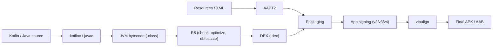

# Git as a Working Tool, Gradle Basics & the Build Pipeline End to End

> **Outcome.** Find the specific commit that introduced a regression with `git bisect`, rather
> than reading the diff between two known-good and known-bad points and guessing.

## 1. Git as a working tool: small PRs, rebase, `bisect`

```bash
# A regression exists somewhere between a known-good tag and HEAD, but not which commit.
git bisect start
git bisect bad HEAD
git bisect good v4.0.0
# Git checks out the midpoint commit; test it, then tell git the result:
git bisect good   # or: git bisect bad
# Git narrows the range by half each time — O(log n) commits to test instead of
# reading every commit's diff and guessing which one plausibly caused it.
```

> [!IMPORTANT]
> `bisect` only works cleanly against small, focused commits — a single commit bundling five
> unrelated changes still narrows down to *that* commit, but leaves the actual guessing
> unresolved within it. Small PRs are not just a review-size preference; they are what makes
> `bisect` (and `git blame`) actually precise instruments instead of blunt ones.

```bash
# Rebase keeps history linear and each commit meaningful, rather than a tangle of
# merge commits that make `bisect` and `blame` harder to read.
git fetch origin
git rebase origin/main
```

## 2. Gradle basics, variants, and signing

```kotlin
android {
    buildTypes {
        debug { isDebuggable = true; applicationIdSuffix = ".debug" }
        release {
            isMinifyEnabled = true
            signingConfig = signingConfigs.getByName("release")
        }
    }
    flavorDimensions += "environment"
    productFlavors {
        create("staging") { dimension = "environment"; buildConfigField("String", "API_URL", "\"https://staging.api\"") }
        create("production") { dimension = "environment"; buildConfigField("String", "API_URL", "\"https://api.example.com\"") }
    }
}
```

A build **variant** is the cross product of build type × flavor (`stagingDebug`,
`productionRelease`, …) — each one is a distinct, independently signable, independently
configurable build target from the same source tree.

## 3. Reading a failing pipeline and fixing your own break

```
CI failure triage, in order:
1. Read the actual failing step's log, not just the red X — "tests failed" and
   "dependency resolution failed" need entirely different fixes.
2. Reproduce locally with the SAME command CI runs, not an approximation — a
   local `./gradlew test` that passes while CI's exact invocation fails often
   means an environment difference (JDK version, locale, timezone) is the cause.
3. Fix and verify locally with that same command before pushing again — pushing
   speculative fixes one at a time to see if CI goes green wastes CI capacity
   and everyone else's queue time.
```

## 4. The build pipeline end to end, source to APK



Reading this diagram as a mental model for triage: a resource-related build failure lives on
the AAPT2 side; a "cannot resolve symbol" failure lives at the Kotlin/Java compile step; a
crash with an obfuscated stack trace (domain 12's Mid article) is downstream of R8; a
"signature verification failed" install error is downstream of the signing step entirely,
unrelated to anything upstream of it.

## Pitfalls & trade-offs

- **Large, multi-purpose commits that defeat `bisect` and `blame`.** Covered above — the tool
  only narrows precisely when history is granular.
- **Merge commits obscuring a linear, readable history.** Makes both `bisect` and reading
  `git log` harder without adding real information.
- **Debugging a CI failure by pushing speculative fixes repeatedly instead of reproducing
  locally with CI's exact command first.** Slower feedback loop and burns shared CI capacity.
- **Treating every red CI build the same regardless of which stage failed.** The pipeline
  diagram above is the map — a failure's stage tells you roughly where to look before reading
  a single line of the actual log.
