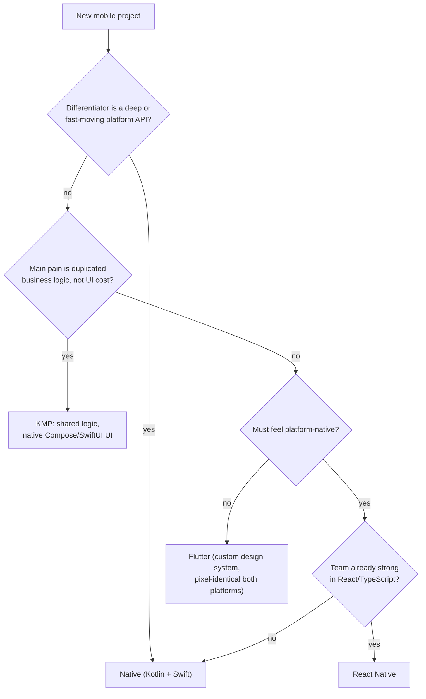

# Native vs React Native vs Flutter — Choosing Per Project

> **Outcome.** Recommend native, React Native or Flutter for a described project and defend it
> by naming the binding constraint, not by listing features.

## 1. What each one actually is

The answers diverge because the three make *different* architectural bets, and the bets — not
the feature lists — predict where each breaks.

| | **Native** | **React Native** | **Flutter** |
|---|---|---|---|
| Language | Kotlin / Swift | TypeScript (JS runtime, e.g. Hermes) | Dart (AOT-compiled to native) |
| UI | Platform toolkits: Compose / SwiftUI | **Real platform widgets**, driven from JS | **Own rendering engine** (Impeller); draws every pixel itself |
| Platform APIs | direct | via native modules / Turbo Modules | via platform channels / FFI |
| Looks like the OS | by definition | yes — it *is* the OS widget | only as far as its Material/Cupertino widgets imitate it |
| New OS feature available | day one | when a binding exists | when a binding exists |
| Shares business logic only | — | — | — (see KMP below) |

The one line that captures it: **React Native renders with the platform's widgets; Flutter
replaces them.** That is why React Native inherits platform look, feel and accessibility for
free but pays a JS↔native crossing cost, while Flutter gets pixel-identical rendering and
consistent performance but must re-implement every platform UI behaviour itself.

> [!NOTE]
> **Kotlin Multiplatform is the fourth option** and is frequently the right one. KMP shares
> business logic — networking, persistence, domain rules — while the UI stays native Compose and
> SwiftUI. It removes the duplication that actually causes bugs (two implementations of the same
> rules drifting apart) without giving up the platform UI layer. If the pain in the described
> project is "we implement every feature twice and they disagree" rather than "we can't afford
> two UI teams," KMP is the answer, and saying so is a stronger response than picking one of the
> three.

## 2. The four constraints that decide it

Do not start from a feature comparison. Start by finding which of these is binding.

**1 — How deep is the platform API surface this app needs?**
Widgets, Live Activities, App Intents, BLE peripheral roles, custom camera pipelines,
`WorkManager`/`BGTaskScheduler` background execution: these reach cross-platform frameworks
through a binding that lags the platform SDK by a release or more, and some have no first-class
binding at all. If the app's *differentiator* is one of these surfaces, this constraint is
binding and the answer is native — the rest of the table stops mattering.

**2 — What skills does the team have, and will have in a year?**
A small team maintaining production-grade Kotlin *and* Swift is a real staffing cost. A team
already strong in React and TypeScript reaches shipping React Native far faster than it reaches
shipping Swift. A team with no JS and no Dart gets no discount from either. This constraint is
binding more often than anyone admits, and it is a legitimate reason, not a compromise.

**3 — Does the UI have to feel native, or has design already committed to a custom look?**
If the design system is custom and identical on both platforms, Flutter is doing exactly what
you want and its "doesn't look native" criticism does not apply. If the product must feel like
each platform — native navigation gestures, platform accessibility behaviour, OS-consistent
controls — Flutter is fighting you, and React Native or native is the fit.

**4 — Is this a new app, or a screen inside an existing one?**
Both React Native and Flutter support add-to-app, but embedding a second runtime in an existing
native app costs binary size (~5–10 MB for Flutter), a startup cost on first entry, and a
permanent two-toolchain build. That is fine for a large, self-contained module and rarely worth
it for two screens.

## 3. The decision path

Every branch here is a *constraint*, not a preference — which is what makes the outcome
defensible in an ADR and revisitable later when the constraint changes.

## 4. Worked recommendations

- **Fintech app with biometric auth, certificate pinning, background sync and a >99.9%
  crash-free target** → **native**. Constraint 1 is binding twice over: security-sensitive
  platform APIs, and a smaller dependency surface for crash-freedom.
- **Internal line-of-business app: forms, lists, a REST API, six-week deadline, a React web
  team** → **React Native**. Constraint 2 is binding; nothing in the app tests the platform
  ceiling.
- **Consumer app with a heavily custom branded design system, identical on both platforms,
  animation-rich** → **Flutter**. Constraint 3 points at it, and Flutter's own rendering pipeline
  is an advantage rather than a compromise here.
- **Existing native Android + iOS apps with the same business rules implemented twice and
  drifting** → **KMP**. The problem is logic duplication; replacing two working native UI layers
  would be solving a different problem.

## 5. How to say it in an interview

> "It depends on which constraint is binding. If the app's differentiator is a deep platform
> API — widgets, background execution, a custom camera pipeline — that decides it for native and
> nothing else matters. If it doesn't, I'd ask what the team already knows and whether the UI has
> to feel platform-native: React Native keeps the platform widgets and suits a React team,
> Flutter renders its own and suits a custom design system. And if the real pain is the same
> business logic written twice, I'd argue for Kotlin Multiplatform with native UI before either.
> Then I'd write it as an ADR with a stated trigger for revisiting, because this is a per-app
> call, not a company identity."

## Pitfalls & trade-offs

- **Answering with a generic pros/cons table.** It implies every row weighs the same. Name the
  binding constraint instead — that is what a Senior-band decision looks like.
- **Treating it as a permanent, company-wide choice.** A company that picked native for its
  flagship three years ago is not bound to pick native for an internal tool with a two-week
  deadline. Decide per app, sometimes per module.
- **Quoting the old React Native bridge as a current fact.** The New Architecture (bridgeless,
  JSI, Turbo Modules) narrowed the serialization overhead substantially. "Narrowed" is accurate;
  "eliminated" is not.
- **Ignoring the second-order costs.** Cross-platform means an extra runtime to upgrade, a
  binding to write whenever a platform API isn't covered, and hiring for a smaller pool. Budget
  those, or the saving is imaginary.
- **Forgetting KMP exists.** In an interview, a candidate who reaches for three options when
  there are four has narrowed the problem prematurely.

For the ADR shape this decision should be written into — context, alternatives, reversibility,
cost, and a trigger for reopening — see the Senior unit of this domain, *ADRs that still hold up
a year later*.
