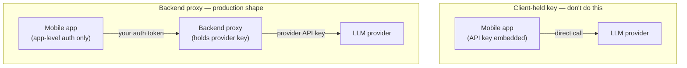

# Backend Proxy vs Client-Side Keys, Key Pools & Streaming for LLM APIs

> **Outcome.** Defend, against a specific counter-proposal to embed the key in the app, why a
> backend proxy is the only production-safe architecture, and design the key pool behind it —
> storage, rotation, load balancing and streaming — so it survives one leaked key and one slow
> provider without an app release.

## 1. Why a backend proxy beats a client-held API key

A key embedded in a mobile app is not a secret, no matter how it's obfuscated — an APK or IPA is
a file the app's own user has full access to, and static analysis or a simple runtime hook
recovers a string constant or an obfuscated one in short order. Certificate pinning does not
change this: pinning stops a network *man-in-the-middle*, it does nothing about someone reading
the key straight out of the binary they already possess. Once one copy of the key leaks, every
installed copy of the app shares that same key, which is what makes the failure mode total rather
than partial.

Concretely, what a client-held key gives up, and what a proxy gets back:

| | Client-held key | Backend proxy |
| :--- | :--- | :--- |
| **Revoking one abusive user** | Impossible without rotating the key for every installed copy of the app | Revoke that user's app-level token; the shared provider key is untouched |
| **Per-user rate limiting / quota** | Not enforceable — the provider only sees "the app," not the individual user | Enforced at the proxy, keyed on your own user IDs |
| **Swapping model or provider** | Requires an app release and a rollout | A server-side config change, live immediately |
| **Spending cap / abuse containment** | One compromised copy can run up unbounded cost on your account | Rate limiting, quotas and anomaly detection sit in front of the key |
| **Prompt templates, redaction, business logic** | Lives in the client, readable by anyone who decompiles the app | Lives on the server, never shipped to the client at all |
| **Audit logging** | Not possible — the provider has no notion of your individual users | Every request is attributable to an authenticated user |

The proxy is not an extra layer of caution on top of an otherwise-fine design — without it,
"one user's phone gets rooted" and "our entire provider account is exposed" are the same event.

## 2. Handling keys server-side, done well

Moving the key to the backend is necessary but not sufficient — the naive version (a key in an
environment variable, read once at boot) still has real failure modes at any scale. What a
mature key-handling layer actually does:

- **Keys live in a secrets manager** (Google Secret Manager, AWS Secrets Manager, HashiCorp
  Vault), never in a config file that ends up in source control or a container image layer.
  Services fetch them via workload identity, not a long-lived service-account JSON file sitting
  on disk.
- **Rotation is a scheduled, non-eventful operation.** If a key can only be rotated by tracing
  down every place it's referenced, it will not get rotated on a regular cadence, and it will
  definitely not get rotated fast during an actual incident.
- **The pool is an abstraction, not a single key.** The application code asks a key-pool service
  for "a healthy key for model X" and never touches a literal key string — this is what makes
  load balancing, per-key rate awareness and hot rotation possible without touching call sites.
- **Rate/quota tracking is centralised and fast** (a Redis counter per key, sliding window or
  token bucket), because provider-side rate limits are enforced per key, and two proxy instances
  each unaware of the other's usage will double-spend the same key's budget under load.
- **A circuit breaker sits in front of each key.** A key returning a run of `429`/`5xx` gets
  pulled out of rotation for a cooldown window automatically, rather than every concurrent
  request discovering the same failure independently.
- **Cost and usage are attributed per user and per feature**, not just per key — this is what
  turns "our bill went up" into "feature X's retry storm did this," rather than a mystery.

## 3. Does every key deserve its own cloud project?

For genuinely independent boundaries — separate products, separate environments (prod vs.
staging), separate customers in an enterprise deployment — **yes**, and the reason is isolation,
not throughput:

- **Billing isolation.** A cost spike is attributable to one project's bill, not smeared across a
  shared account you then have to reconstruct from logs.
- **Blast-radius containment.** A leaked key is revoked and rotated inside its own project without
  touching anything else's traffic.
- **IAM boundaries.** A compromised service can only reach the secret in its own project — least
  privilege enforced by the platform, not by application-level convention.
- **Quota isolation.** Some provider and cloud-platform quotas are enforced per project; one
  feature's traffic spike doesn't starve another's.

The trade-off is real operational overhead: N projects means N sets of IAM policies, N network
configurations, N places CI/CD has to know about. **This stops being the right tool once the
motivation shifts from isolation to throughput** — spreading load across several keys of the
*same* feature to raise request-per-second capacity is a load-balancing problem (Section 4), not
an isolation problem, and siloing those keys into separate projects only adds cross-project
plumbing to solve a problem a shared key-pool abstraction already solves more simply. Isolate by
project along business, billing or compliance boundaries; pool by key within one boundary to
raise throughput.

## 4. Load balancing a pool of N keys for throughput

Given N API keys on independent paid accounts, each with its own rate limit and its own current
load, the goal is maximum sustained throughput without tripping any single key's limit. Three
candidate algorithms, in increasing order of how well they actually achieve that:

| Algorithm | How it picks a key | Where it falls short |
| :--- | :--- | :--- |
| **Round robin** | Cycles through keys in fixed order | Blind to real-time load and to keys with different quotas — it will happily send a request to a key that's already near its rate limit while an idle key sits one slot away |
| **Weighted round robin** | Cycles proportional to each key's *known* quota | Better, but still blind to *current* in-flight load and to transient provider-side slowness on one account |
| **Least outstanding requests, health-aware** | Routes to whichever healthy key currently has the fewest in-flight requests, with a token-bucket limiter and circuit breaker excluding keys that are rate-limited or erroring | Adapts to real-time load and heterogeneous latency per account; this is the one that actually maximises throughput under production conditions |

**Least outstanding requests with health-aware exclusion is the answer**, because request
latency to an LLM provider is not uniform (it varies with prompt length, model load and output
length), and a static schedule like round robin cannot see that a given key is currently carrying
three long-running generations while another sits idle. Layer a per-key token-bucket rate
limiter underneath it so the balancer never routes past a key's own known limit, and a circuit
breaker so a key returning errors is excluded for a cooldown instead of continuing to receive a
share of traffic it can't serve.

## 5. BYOK's biggest drawback for a mainstream product

**Bring Your Own Key** — the product asks each customer to create their own account with the
model provider, generate an API key, and paste it into the app's settings, and the product calls
the provider using that key rather than a pooled key it manages itself.

For a developer-tool audience that already has provider accounts and cares about cost
transparency and data ownership, BYOK is a reasonable, even attractive, option. **For a mainstream
consumer or general-business SaaS product, its biggest drawback is activation friction that kills
onboarding**: asking a non-technical user to sign up with a separate AI provider, navigate to a
developer console, generate a key, and correctly paste it into your app is a multi-step technical
task the overwhelming majority of a mainstream audience will not complete — every one of those
steps is a drop-off point in the funnel before the user has experienced any value from the
product at all.

The secondary costs compound this: the product loses the ability to guarantee a consistent
quality/latency/uptime SLA, because it now depends on each individual user's own account tier and
rate limits; it loses centralised optimisation (shared caching, model routing, volume-discount
pricing) because every user's traffic is isolated to their own key; and it pushes real
operational burden — rotating an expired key, debugging a rate-limit error, understanding a
provider bill — onto a user who has no context for any of it and no reason to want it. A pooled
backend-proxy key (Sections 1–2) keeps that entire burden, and the entire optimisation
opportunity, on the vendor's side, which is exactly where a mainstream product's users expect it
to sit.

## 6. Streaming responses (SSE) through the proxy — the top operational risk

Server-Sent Events let the client render tokens as they're generated instead of waiting for the
full response, and the proxy has to relay that stream rather than buffer-then-forward it, or the
entire latency benefit disappears. The risk that has to be controlled above all others is
**resource exhaustion from long-lived connections that outlive the client's interest in them**:

- **A streamed generation holds a connection — and, on a thread-per-request server, a worker
  thread — open for the entire generation, which can be tens of seconds.** Under load, this
  makes open connections the bottleneck resource, not CPU. Build the proxy on an async,
  event-driven runtime (Node, Go, async Python/ASGI) rather than a thread-per-request model, or
  size the thread pool with this in mind.
- **A client that disconnects mid-stream — the app backgrounded, the network dropped — leaves a
  dangling upstream generation if the proxy doesn't actively detect the disconnect and cancel the
  upstream call.** Without this, you keep paying for and computing tokens nobody will ever
  receive, and under enough concurrent abandonment this becomes a real cost and capacity leak,
  not a theoretical one.
- **An intermediate layer can silently buffer the whole response before flushing it** — some CDN
  configurations, a default reverse-proxy setup, or a corporate network proxy will buffer an SSE
  stream unless explicitly configured for passthrough (correct `text/event-stream` content type,
  proxy buffering disabled, compression disabled on the stream). This doesn't break the feature
  visibly — it just quietly turns "tokens as they arrive" back into "wait for the whole answer,"
  and it's very easy to ship without noticing in an environment that doesn't reproduce the
  intermediate layer.
- **Load-balancer or gateway idle-timeouts shorter than real generation time will kill the
  connection mid-answer.** These need to be sized against the slowest realistic generation, not
  against a typical one.

Get client-disconnect propagation and buffering-layer verification right, size timeouts for the
slow tail rather than the median, and the rest of streaming is a straightforward relay.

## Pitfalls & trade-offs

- **"We'll obfuscate the key" as a substitute for a proxy.** Obfuscation raises the cost of
  extraction from trivial to merely inconvenient — it does not change the failure mode from
  total to partial, and does not restore any of the server-side controls in Section 1's table.
- **Siloing keys into separate cloud projects purely to parallelise one workload.** That's a
  load-balancing problem wearing an isolation-boundary costume — solve it with a key pool inside
  one project, and reserve project-per-key for a genuine business/billing/compliance boundary.
- **Round robin across a key pool and calling it "load balanced."** It is balanced by call count,
  not by load — it will route into an already-saturated key while an idle one sits nearby, which
  is the opposite of what a throughput-optimising balancer is for.
- **Recommending BYOK to a mainstream audience because it's simpler for the backend team.**
  Simpler for the backend is not the same as viable for the funnel — the activation-friction cost
  in Section 5 is usually large enough to outweigh the backend simplicity for any product whose
  users aren't already developers.
- **Shipping SSE support without testing it through the actual production network path.**
  Buffering by an intermediate proxy or CDN is invisible in local development and only shows up
  once real infrastructure sits between the backend and the client.
