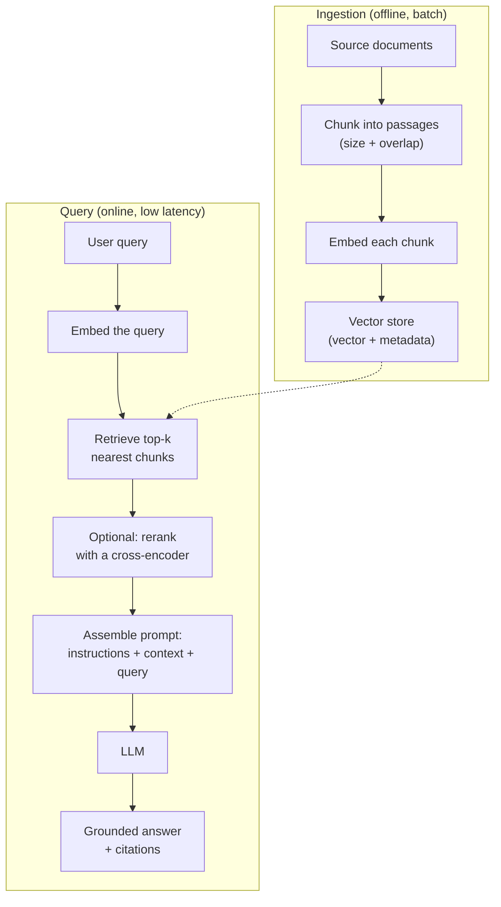

# Building and Evaluating RAG Systems — Vector Stores & System-Level Metrics

> **Outcome.** Design a RAG pipeline's ingestion and query paths end to end, explain why a vector
> database's index is approximate rather than exact, and name the retrieval-level and
> generation-level metric each addresses when a RAG system's answers are wrong.

**Retrieval-Augmented Generation (RAG)** answers the question this domain's core Senior unit
raised: what to do when a feature needs the model to know things it wasn't trained on — your
product's own documents, a customer's private data, anything that changes after the model's
training cutoff. Instead of retraining or fine-tuning the model on that data, RAG finds the
handful of relevant passages at query time and hands them to the model as context.

## 1. The RAG development workflow, end to end

1. **Chunk the source documents.** Split into passages small enough to be individually relevant
   and large enough to keep their meaning intact — a chunk that's too small loses context (a
   sentence fragment with its referent in the previous sentence), too large and irrelevant
   surrounding text dilutes the embedding and wastes context-window budget on retrieval. A small
   overlap between consecutive chunks (10–20%) avoids splitting a key fact exactly at a chunk
   boundary.
2. **Embed each chunk** with an embedding model, and store the resulting vector alongside the
   chunk's text and metadata (source document, section, last-updated date, access-control tags)
   in a vector store.
3. **At query time, embed the user's query** with the *same* embedding model used for ingestion —
   a mismatch here is a common, hard-to-notice bug, since the two embeddings will simply produce
   poor-quality retrieval rather than an outright error.
4. **Retrieve the top-k nearest chunks**, optionally combined with a metadata filter (only this
   customer's documents, only documents updated in the last year) and optionally combined with a
   traditional keyword search (**hybrid search**) to catch exact terms — product codes, error
   messages — that semantic similarity alone sometimes misses.
5. **Optionally rerank** the retrieved set with a heavier cross-encoder model that scores
   query/chunk pairs more precisely than the fast vector search that produced the candidate set —
   worth the extra latency when retrieval quality, not speed, is the bottleneck.
6. **Assemble the prompt**: system instructions, the retrieved chunks (with enough structure that
   the model can cite which chunk supports which claim), and the user's query.
7. **Call the model and return the answer**, ideally with a citation back to the source chunk so
   the answer is checkable rather than a black box.
8. **Evaluate and iterate** (Section 3) — tune chunk size, overlap, top-k, and whether reranking
   or hybrid search earns its latency cost, against real metrics rather than a handful of manually
   inspected examples.

Ingestion and query are architecturally two different pipelines with different constraints:
ingestion runs offline in batch, can be slow, and needs to handle re-indexing when source
documents change (with embedding-model versioning, since re-embedding everything is required if
the embedding model itself changes); query runs online, has to be fast, and is where the latency
and cost budgets from this domain's other units actually apply.

## 2. What a vector is, and the principles behind searching them

A **vector embedding** is a fixed-length array of floating-point numbers produced by an embedding
model from a piece of text (or an image, audio, etc.), positioned in a high-dimensional space such
that **semantically similar inputs produce nearby vectors** — this is the entire property RAG's
retrieval step depends on, and it holds because the embedding model was trained (typically via
contrastive learning: pull known-similar pairs together, push known-dissimilar pairs apart) to
make it hold, not because it's a property of vectors in general.

**Similarity metrics** — how "nearby" gets measured:

| Metric | What it compares | When it's the right choice |
| :--- | :--- | :--- |
| **Cosine similarity** | The angle between two vectors, ignoring magnitude | The default for most text-embedding use cases — magnitude often just reflects text length, not meaning |
| **Dot product** | Angle *and* magnitude | Correct when the embedding model was trained with dot product in mind and vectors are already normalised — otherwise magnitude differences distort the ranking |
| **Euclidean (L2) distance** | Straight-line distance in the vector space | Common for image embeddings and some non-text domains; behaves like cosine similarity once vectors are normalised to unit length |

**Dimensionality** is a real trade-off, not a free "more is better" knob: a 1536- or 3072-dimension
embedding captures more semantic nuance than a 384-dimension one, at proportionally higher
storage and compute cost per vector, and higher latency per comparison — the right size is the
smallest one that still separates your actual queries correctly, found empirically (Section 3),
not by defaulting to whatever the largest available model offers.

**Approximate nearest-neighbour (ANN) search** is why a vector database is a distinct piece of
infrastructure rather than "an embedding column in Postgres": exact nearest-neighbour search
compares the query vector against every stored vector, which is linear in the number of vectors
and becomes too slow once a store holds millions of them. Vector databases instead build an index
that finds *almost certainly* the nearest vectors in far less than linear time, trading a small,
tunable amount of recall for a large speedup:

- **HNSW (Hierarchical Navigable Small World graphs)** — the most common approach today. Builds a
  multi-layer graph where each vector is a node connected to its approximate neighbours; search
  descends through layers, taking large hops at the top and refining locally at the bottom. Very
  good recall/speed trade-off, at the cost of more memory per vector than simpler indexes.
- **IVF (Inverted File Index)** — clusters the vector space ahead of time, and at query time
  searches only the clusters nearest the query vector rather than the whole space. Cheaper in
  memory than HNSW; recall depends heavily on how many clusters get probed per query.
- **Product quantization** — compresses each vector into a much smaller approximate
  representation to cut memory footprint, often combined with IVF or HNSW when the vector count
  is large enough that memory, not compute, is the binding constraint.

A vector database is, in practice, an ANN index plus the ordinary database concerns a production
system needs on top of it — metadata filtering combined with the vector search, durability,
sharding and replication at scale, and incremental upserts as source documents change.

## 3. Evaluating a RAG system at the system level

Eyeballing a handful of example answers tells you almost nothing about whether a RAG system works,
because it can't distinguish "the model reasoned badly" from "the model never received the right
context to reason with" — and the fix for those two failures is completely different. System-level
evaluation splits the pipeline into the two stages that can each fail independently, and measures
both, plus the operational cost of running it:

**Retrieval-level metrics** — did the pipeline find the right information at all:

| Metric | What it measures |
| :--- | :--- |
| **Context Precision** | Of the chunks retrieved, what fraction were actually relevant to the query |
| **Context Recall** | Of the information actually needed to answer correctly, what fraction did retrieval surface — measured against a reference answer |
| **Hit Rate / Recall@k** | Did at least one genuinely relevant chunk appear in the top-k results |
| **MRR (Mean Reciprocal Rank)** | How high the first relevant chunk ranked — a relevant chunk buried at position 20 is much less useful than one at position 1, even though both count as a "hit" |

**Generation-level metrics** — given the retrieved context, did the model use it correctly:

| Metric | What it measures |
| :--- | :--- |
| **Faithfulness / Groundedness** | Whether every claim in the generated answer is actually supported by the retrieved context, or the model added something beyond it — the specific, measurable form of "did it hallucinate" for a RAG system |
| **Answer Relevance** | Whether the generated answer actually addresses the question that was asked, independent of whether it's grounded |

**End-to-end and operational metrics** — the numbers that decide whether the system is good
enough to ship, not just internally consistent:

- **Answer correctness against a labelled reference set** — semantic similarity to a known-good
  answer, or an LLM-as-judge rubric scored against one, run on a held-out set of real questions
  with real expected answers.
- **Latency and cost per query**, tracked the same way the rest of this domain tracks them, since
  a system-level evaluation that ignores these can recommend a configuration (larger top-k, an
  extra reranking pass) that improves quality metrics while making the feature too slow or too
  expensive to ship.

Frameworks such as **RAGAS**, **TruLens** and **LangSmith's** evaluation tooling implement most of
the retrieval- and generation-level metrics above against a labelled or LLM-judged dataset, and are
the practical way to run this evaluation repeatably rather than re-deriving it by hand — the
metrics matter more than the specific tool, because they're what let you attribute a bad answer to
"retrieval missed it" versus "generation ignored what it was given," which is the whole point of
evaluating at the system level.

## Pitfalls & trade-offs

- **Embedding the query with a different model than the one used for ingestion.** This doesn't
  error — it silently degrades retrieval quality in a way that looks like "the model isn't very
  good" when the actual defect is upstream of the model entirely.
- **Chasing a single "accuracy" number instead of splitting retrieval from generation.** A low
  score with no breakdown tells you the system is bad; it doesn't tell you whether to fix chunking,
  the embedding model, top-k, or the prompt — and those are different fixes with different costs.
- **Treating a bigger embedding model or a larger top-k as a free quality improvement.** Both cost
  latency and money, and past a point they stop improving Context Precision while continuing to
  cost more — measure the actual marginal gain rather than assuming "more" helps.
- **Skipping Faithfulness because Answer Relevance looks good.** A model can produce a relevant,
  fluent, well-organised answer that says something the retrieved context never supported — this
  is the RAG-specific form of hallucination, and it is invisible to a metric that only checks
  whether the answer addressed the question.
- **Evaluating on a handful of hand-picked examples instead of a real labelled set.** It rewards
  whichever configuration happens to look best on those few cases, which is exactly the kind of
  overfitting a system-level, held-out evaluation set exists to catch.
