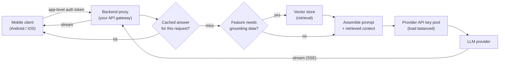

# The Shape of a Production LLM Feature — Keys, Retrieval, Cost & Safety

> **Outcome.** Sketch the server-side architecture for a new AI feature end to end — key
> handling, retrieval if the feature needs it, the caching layer, and the failure mode when the
> model API is slow or down — and name which of this domain's deep-dive units it depends on.

Every production feature that puts an LLM behind a mobile app — a chat assistant, a
summarisation button, a smart-reply suggestion — is built from the same handful of pieces,
regardless of what the feature looks like on screen. This unit is the map of those pieces. Each
piece gets a full worked treatment in one of this domain's per-problem notes; this unit is where
you decide *which* of those problems your feature actually has, before going deep on any one of
them.

## 1. The rule that shapes every one of these designs

**The mobile client never holds a model-provider API key, and never calls the model provider
directly.** Every request from the app goes to a backend you control, which holds the key and
calls the model provider on the app's behalf.

This single rule is why "call an LLM from a mobile app" is a backend system-design problem, not a
mobile networking problem — see this domain's *LLM Backend Architecture* unit for the full
reasoning (extractable keys, no request-level control, no way to revoke one compromised user
without breaking everyone, and no way to enforce a spending cap) and for what the proxy actually
has to do once it exists: authenticate the app's own users, rate-limit per user, choose which
model to call, and manage the pool of upstream keys.

## 2. The four pieces of a production LLM feature

- **The proxy** — the gate every request passes through. Owns app-user authentication, request
  logging, rate limiting, and the choice of which upstream model and key to use for this
  request. Full treatment: *LLM Backend Architecture*.
- **Retrieval, if the feature needs grounding** — not every feature does. A generic writing
  assistant doesn't need it; "answer questions about our product's documentation" does. Full
  treatment: *RAG & Vector Systems*.
- **Caching** — the highest-leverage lever on both cost and latency for any feature with
  repeated or near-repeated requests, which is most of them. Full treatment: *Cost & Latency
  Optimisation*.
- **The model call itself, and anything agentic layered on top** — a single request/response
  call for most features; a multi-step reasoning-and-acting loop for features that need to take
  actions, not just answer. Full treatment: *Agents, Fine-Tuning & Prompt Security*.

## 3. Where the money and the milliseconds go

Three costs stack on every request that reaches the model provider: the input tokens (the prompt,
including any retrieved context you assembled), the output tokens (the generated answer), and the
network hop itself (client → proxy → provider → proxy → client). Two of those three — input
tokens and the double network hop — are exactly what a well-placed cache eliminates for a repeated
question, which is why caching is treated as its own deep dive rather than a footnote: on a
feature with any meaningful repetition in what users ask, it is very often the single biggest
lever available, ahead of model choice.

Latency, separately, is why streaming exists: a user who sees the first tokens of an answer in
300ms perceives the feature as fast even if the full answer takes four seconds to finish
generating, whereas the same four seconds spent waiting for one complete response reads as slow.
Streaming moves the operational risk from "is it fast" to "does the connection stay open and
correctly wired all the way through the proxy" — see the deep dive on backend architecture for
what breaks there.

## 4. Where the design has to defend itself

An LLM feature has an attack surface a normal REST endpoint doesn't: the model's own input is,
by construction, untrusted natural-language text the model was built to follow instructions
in — which means any text the model reads (a user's message, a retrieved document, a tool's
output) is a potential vector for **prompt injection**, an attempt to make the model ignore its
real instructions and follow ones smuggled into that text instead. This gets a full treatment,
alongside the agentic loop that makes it more dangerous (an agent that can *act*, not just
answer, turns a hijacked instruction into a hijacked action) in this domain's fourth deep dive.

## 5. Which deep dive to read for which problem

| The problem in front of you | Read |
| :--- | :--- |
| "Should the app hold the API key, or call our own backend?" · key rotation, per-key isolation, spreading load across several paid accounts · streaming SSE through a proxy without breaking | *LLM Backend Architecture* |
| "The feature needs to answer from our own documents/data, not general knowledge" · picking a vector database · measuring whether the retrieval is actually any good | *RAG & Vector Systems* |
| "Users keep asking near-identical questions and we're paying for every one" · repeated prompts from the mobile client itself · where conversation memory should live | *Cost & Latency Optimisation* |
| "We want the model to take multi-step actions, not just answer" · fine-tuning a model cheaply for one narrow task · a user's input controlling the model's behaviour in a way it shouldn't | *Agents, Fine-Tuning & Prompt Security* |

## Pitfalls & trade-offs

- **Designing the model call before designing the proxy.** The proxy's shape — auth, rate
  limiting, key management — is the part of this system that actually differs from feature to
  feature and team to team; the call to the model provider itself is close to boilerplate once
  the proxy is right.
- **Adding retrieval to a feature that doesn't need it.** RAG is a specific answer to "the model
  needs to know things it wasn't trained on and can't fit in one prompt" — a feature that's happy
  with the model's general knowledge doesn't get better by bolting on a vector store, it gets
  slower and more expensive.
- **Treating caching as an optimisation for later.** On a feature with any real repetition in
  what users ask, it's frequently the single biggest cost and latency lever available — deferring
  it is deferring the cheapest win in the whole design.
- **Bolting security on after the agent loop is built.** Prompt injection has to be a design
  constraint from the first pass at the architecture, not a review comment on the finished
  feature — an agent that can already take actions is a much more expensive place to retrofit
  input validation than a plain request/response call.
